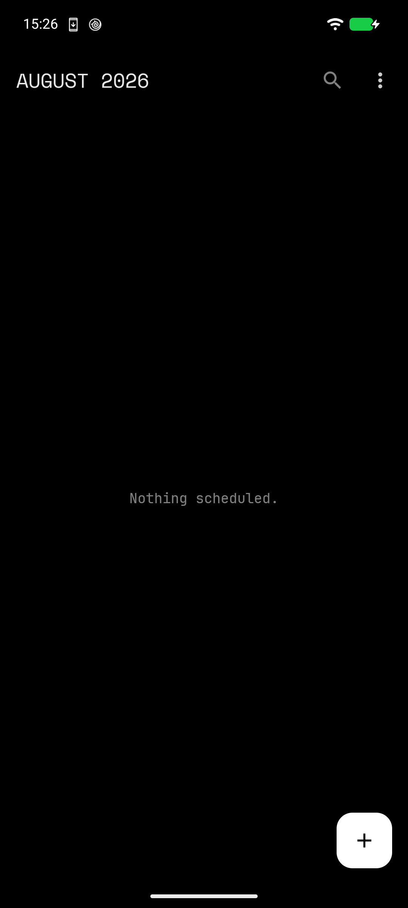

# XX-Calendar

> It shows you your day. That is the whole pitch.

A cleanroom equivalent of Google Calendar. It syncs with Google — because that
is where the invitations arrive — and then refuses to do the other ninety
things Google Calendar does at you. No auto-added flight bookings, no
illustrated dinner events, no Goals, no "what's new" takeover, no Meet button
welded to every event.



```
package: com.piercingxx.calendar        minSdk 26 (Android 8)
version 0.1.0                           target/compileSdk 35
```

## How it syncs

DAVx⁵ owns the Google account and the OAuth. XX-Calendar is a normal client of
Android's calendar provider, which means it ships with **no `INTERNET`
permission** — the manifest does not declare it, and the build fails if it ever
does:

```
aapt2 dump permissions app/build/outputs/apk/debug/app-debug.apk
```

What comes back is calendar read/write, notifications, boot-completed, exact
alarms, and the `WAKE_LOCK` / `ACCESS_NETWORK_STATE` / `FOREGROUND_SERVICE`
trio that Glance pulls in transitively. `INTERNET` is not on the list, and a CI
gate fails the build the day it is.

No account, no network, no telemetry, no analytics. Any CalDAV server works,
including one on your own hardware.

## Opens where you left it

Launch reopens the view you closed — Schedule, Day, Week or Month. This reuses
the existing `default view` key instead of adding a parallel "last view" one,
so the Settings row always reads as the view the next launch will actually
open. Switching views in the top bar rewrites that key; cycling the row in
Settings still works, it just holds until your next in-app switch. One
setting, one truth, no second key to drift out of sync.

## Reminders

Reminder notifications carry their own bundled chime,
`app/src/main/res/raw/xx_calendar.wav`, on the channels `reminders_v2` and
`reminders_heads_up_v2`. The version suffix is not decoration: Android freezes
a channel's sound the moment the channel is created, so shipping a sound means
shipping a new channel id. The soundless v1 channels are deleted in the same
pass. Heads-up and quiet reminders are separate channels because importance is
a channel property, not a per-notification one.

## Theming

Nine apps in the family share one theme contract. XX-Launcher broadcasts
`xx.launcher.THEME_CHANGED` carrying a theme name and a background ARGB; every
app has an exported receiver that persists the choice and repaints. Eight
presets: AMOLED Night, Graphite, Forest Night, Ocean Drift, Burgundy, Paper,
Mist, Custom. Pick once in the launcher, the whole phone follows. There is no
in-app picker here — the launcher is the picker.

The home-screen widgets stay dark whatever the active theme is. That is
deliberate, not a bug: Glance widgets paint on the Ink ground and keep doing so
under Paper and Mist.

**Defaults with a spine.** Notification content preview, heads-up alerts, and
declined events are all **off** by default — and every switch in Settings
actually switches something; the few that can't yet are absent, not
decorative. There are no guests, no RSVP, no tasks, no Goals, and none of
Google's *Reminders* entity — the reminder alarms XX-Calendar schedules for
your own events are local notifications, not Google's feature by that name.
The `+` button has one entry.

## Build

```bash
export ANDROID_HOME=$HOME/Android/Sdk
./gradlew testDebugUnitTest          # 326 JVM unit tests
./gradlew lint                       # 0 errors
./gradlew assembleDebug assembleDebugAndroidTest
```

Toolchain: JDK 21 running Gradle 8.11.1, JVM target 17, Android SDK platform
35 (AGP 8.9.1, Kotlin 2.1.20). Robolectric 4.13 for the provider fakes.

**Status:** feature-complete against the plan and installed on a Pixel 6 under
GrapheneOS; the provider layer is still unproven against real DAVx⁵ data.
326 JVM unit tests green, `lint` clean, `assembleDebug` and
`assembleDebugAndroidTest` green, and the built APK provably declares no
`INTERNET` (a local pre-push hook mirrors the CI gate while CI billing is
broken). Three items stay open — on-phone review of the
[sigil mock](design/mock/sigil-mock.html), WS3's questions against real DAVx⁵
data, and the instrumented suite runtime, which is the difference between
"compiles" and "works". Details in [review.md](review.md) and
[todo.md](todo.md).

| Doc | What it is |
|---|---|
| [design.md](design.md) | The spec — architecture, data model, UI, build order |
| [todo.md](todo.md) | The build plan — workstreams and gates |
| [design/google-calendar-teardown.md](design/google-calendar-teardown.md) | Every Google Calendar feature, and why it stayed or went |

Built for GrapheneOS. No Play Services.

---

Layout and information architecture were reimplemented from published
screenshots and documentation. No Google source, assets, or branding are used —
see the teardown, §1.
